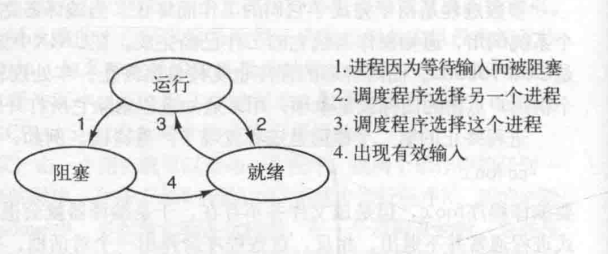

# 进程与线程
## 进程
#### 进程模型
操作系统种最核心的概念就是进程，进程就是对正在运行的程序的一种抽象，操作系统的其他概念就是围绕进程展开，因此深入了解和学习进程是十分有必要的。概括的讲，一个进程就是一个正在执行的程序的实例，包括程序计数器，寄存器，和变量的当前值。在这里我们假设我们的计算机只有一个CPU(虽然现在多核处理器的计算机大行其道)，这有助于我们简化对问题的分析。在多道程序设计系统中，CPU通常是在多个程序之间不停切换，每个程序执行相当短的时间，一般在几十到几百毫秒，这就给我们用户造成了多道程序并行执行的伪并行假象(现在的CPU已经在硬件上支持并行了)。进程和程序之间的关系十分微妙，一个进程是某一种类型的一个活动，它包含程序、输入、输出和状态。进程就好比是程序的一个实例，同一个程序执行两次会得到两个进程。
#### 进程的创建
操作系统需要由方式创建一个进程。对于一些简单的只执行一个程序系统(如微波炉中的控制器)，课能在系统启动时就已经创建好了需要执行的进程，因为这些进程的内容相对固定，因此相对简单。对于更通用的系统，需要有某在方法在系统需要时按照需要创建进程。如下是四种时间会导致系统创建进程: 
①系统初始化。 
②正在运行的进程调用了创建进程的系统调用(System Call)。 
③用户请求创建一个进程。 
④一个批处理系统的初始化。 
启动操作系统时通常会创建很多进程，其中很多进程是前台进程，和有很多后台进程，这些进程与特定的用户没有关系，属于操作系统，这些后天进程具有某些功能，例如Web进程会处理用户的请求，邮箱进程会检查是否有邮件到达。这些守候在后台服务的进程通常被称之为守护进程(daemon)。在UNIX及其衍生系统中可以通过ps命令查看系统有哪些进程，Windows系统可以查看任务管理器。除了在系统初始化时创建进程，正在执行的进程通常也能够创建进程来帮助其完成任务，对于Windows的图形界面，通过双击就能启动应用，这是一种用户主动创建进程的方式。对于批处理系统，当提交一个批处理作业时，批处理操作系统就会创建一个进程来处理批处理作业。在类UNIX系统中，创建进程的系统调用只用fork。在调用fork后，这两个进程拥有相同的内存映像，同样的环境变量，和同样的打开的文件。在创建了进程后，父子进程拥有不同的地址空间(内存地址集合)。对于父子进程，不可变内存区域可以共享，可变内存区域不可共享。
#### 进程的终止
进程由创建就有终止，进程终止可能是自愿的，也可能是被迫的，以下几种情况会导致进程: 
①程序执行完成自动退出(自愿的) 
②程序执行遇到错误退出(自愿的) 
③严重错误(非自愿) 
④被其他进程杀死(非自愿)
#### 进程的层次结构
在类UNIX操作系统中，父进程和子进程是以一种树的关系维系在一起，真个系统是以一颗init进程为根的树。相反在Windows系统中进程间没有这种关系，所有进程的地位平等。
#### 进程的状态
进程的状态:创建，就绪态，运行态，阻塞态，终止。进程在就绪、阻塞、运行这三种状态之间进行轮转。轮转关系如下: 

 转化1:当正在运行的程序需要执行I/O操作(等待用户输入，等待打印机)时，会发生转化1，由运行态转到阻塞态，CPU会被调度程序调度其他的进程继续执行，而被阻塞的进程则等待I/O事件发生。
 转化2:当正在执行的进程使用完了CPU分配的时间片，就会发生转换2，由运行态转化的就绪态，通常会把进程保存在操作系统内部维护的就绪队列，以便下次被调用程序再次调用使用CPU执行程序。
 转化3:当新创建的进程或者刚刚由运行态转到就绪态的进程再次被调度程序(Scheduler)调度获得CPU使用权就会发生转换1。
 转化4:当等待I/O时间的进程的I/O实践发生了，这是他不能直接执行，需要先转入到就绪态，等待在后续被Scheduler调度从而再次获得执行。 
转化2和转化3会使用到调度程序，用户可能都感受不到它的存在，调度程序需要决定应当那个程序运行，何时运行，运行多长时间(这在后面的调度算法时会讲到)。
#### 进程的实现
为了实现进程模型，操作系统需要维护一张表格，既进程表(process table),每个进程占用进程表中的一项，该表项包含进程的一些重要信息，例如程序计数器，堆栈指针，内存分配状态，打开的文件状态，账号信息和调度信息(优先级等)，以及进程又运行态转化到就绪态和阻塞态需要保存的信息，以便进程再次执行的时候能够接着上一次执行的位置执行，就好像进程从没有中断过一样。
## 线程
#### 为什么引入线程
为什么在已经有了进程的基础之上还需要引入线程，有很多理由说明线程是非常有必要的。系统需线程(多线程)的原因：如果某个进程中有多个活动，多个活动之间没有相互的关联，对于传统的单线程进程，一些活动的执行可能会被其他活动因为执行时间过长或者发生I/O而阻塞，因此如果引入线程(多线程)将极大的提升系统的性能，同时程序的设计模型也变得什么清晰简单。同时，线程相对于进程是更加轻量级的，线程的创建、销毁、调度都比进程完成这些操作需要更小的代价，创建一个线程比创建一个进程快上10~100倍，因此对于大量线程需要动态创建时这一特性将十分有益。在性能上，如果多线程属于CPU密集型，
#### 经典的线程模型
#### POSIX线程
#### 在用户空间实现线程
#### 在内核空间实现线程
#### 混合实现
#### 线程的一些特性

## 进程与线程之间的区别与联系

